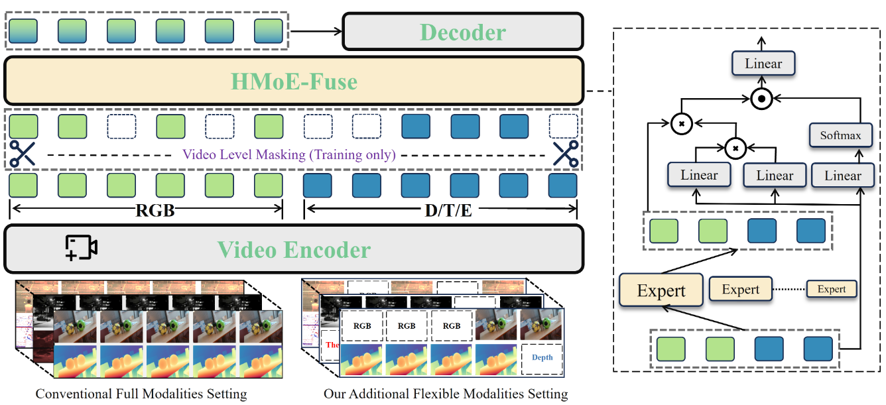
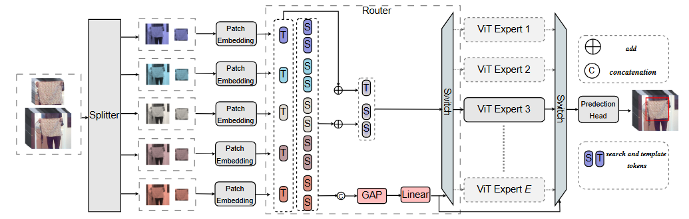

I am an incoming Ph.D. student at [INSAIT](https://insait.ai/), under the supervision of [Danda Pani Paudel](https://scholar.google.ch/citations?user=W43pvPkAAAAJ&hl=en) and [Luc Van Gool](https://scholar.google.com/citations?user=TwMib_QAAAAJ&hl=en). Previously, I obtained my master's degree from Xidian University in June 2025. Before that, I received my B.E. degree from Chang'an University, China, in July 2022. I was an intern or visiting student at Tele AI, supervised by [Jiawei Shao](https://shaojiawei07.github.io/) and [Xuelong Li](https://scholar.google.com/citations?user=ahUibskAAAAJ&hl=zh-CN).

## Publications

## Publications

  

    
ICCV 2025

    
  

  

    What You Have is What You Track: Adaptive and Robust Multimodal Tracking
    - **Yuedong Tan\***, Jiawei Shao, Eduard Zamfir, Ruanjun Li, Zhaochong An, Chao Ma, Danda Pani Paudel, Luc Van Gool, Radu Timofte, Zongwei Wu
    - [**[Paper]**](https://arxiv.org/pdf/2405.17773) [**[Repo]**](https://github.com/supertyd/XTrack)
  

  

    
ICCV 2025

    
  

  

    XTrack: Multimodal Training Boosts RGB-X Video Object Trackers
    - **Yuedong Tan\***, Zongwei Wu, Yuqian Fu, Zhuyun Zhou, Guolei Sun, Eduard Zamfir, Chao Ma, Danda Pani Paudel, Luc Van Gool, Radu Timofte
    - [**[Paper]**](https://arxiv.org/pdf/2405.17773) [**[Repo]**](https://github.com/supertyd/XTrack)
  

  

    
TCSVT 2025

    
  

  

    HyperTrack: A Unified Network for Hyperspectral Video Object Tracking
    - **Yuedong Tan\***, Wenfang Sun, Jingyuan Li, Shuwei Hou, Xiaobo Li, Zhe Wang, Beibei Song
    - [**[Paper]**](https://arxiv.org/pdf/2405.17773) [**[Repo]**](https://github.com/supertyd/XTrack)
  

  

    
TMM 2025

    
  

  

    HotMoE: Exploring Sparse Mixture-of-Experts for Hyperspectral Object Tracking
    - Wenfang Sun, **Yuedong Tan\***, Jingyuan Li, Shuwei Hou, Xiaobo Li, Yingzhao Shao, Zhe Wang, Beibei Song
    - [**[Paper]**](https://ieeexplore.ieee.org/document/10855488) [**[Repo]**](https://github.com/supertyd/hotmoe)
  

  

    
Whisper 2023

    
  

  

    HHTrack: Hyperspectral Object Tracking Based on Hybrid Attention
    - **Yuedong Tan\***, Wenfang Sun, Jieran Yuan, Wenwang Du, Zhe Wang, Nan Mao, Beibei Song
    - [**[Paper]**](https://ieeexplore.ieee.org/document/10431060) [**[Repo]**](https://github.com/supertyd/hotmoe)
  

  

    
CVPR 2025

    
  

  

    Complexity Experts are Task-Discriminative Learners for Any Image Restoration
    - Eduard Zamfir, Zongwei Wu, Nancy Mehta, **Yuedong Tan\***, Danda Pani Paudel, Yulun Zhang, Radu Timofte
    - [**[Paper]**](https://arxiv.org/abs/2411.18466) [**[Repo]**](https://github.com/eduardzamfir/MoCE-IR)
  

